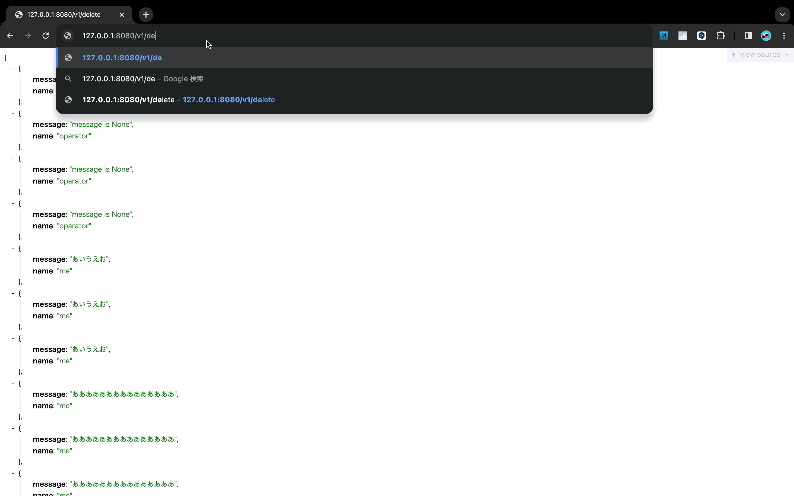
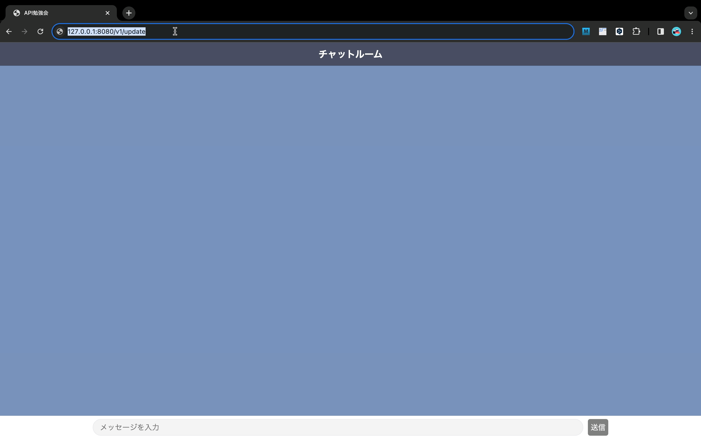
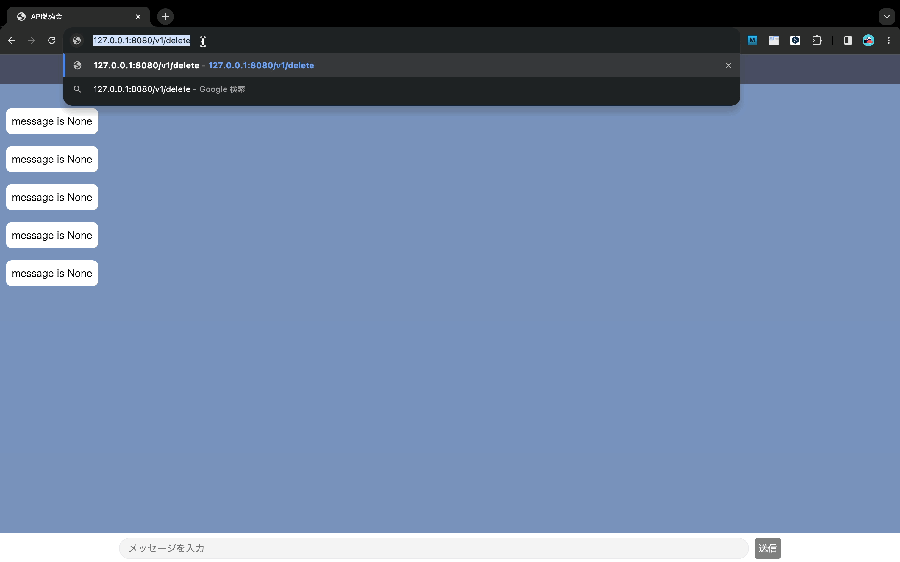
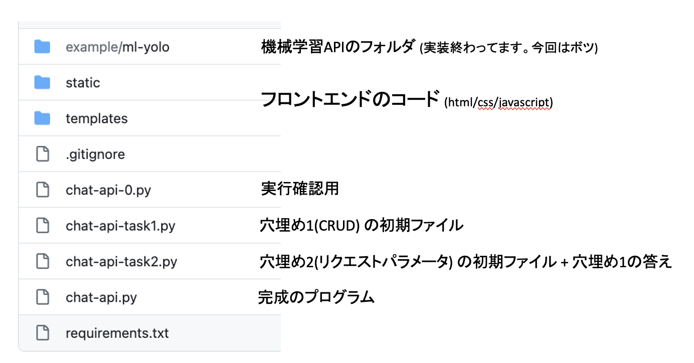

# api

## 概要
API勉強会用のリポジトリ
勉強会に必要なファイルが全て入ってます

## 詳細
CRUDを学びながらチャットアプリを作っていきます
今回データはDBではなく、リストへ追加し保持します
データを永続化するため、DBへ格納するのが一般的です。勉強会の目的が`APIの概要について理解すること`なので、DBに関する処理については触れません。

### デモ
|  API+チャットアプリ  |
| ---- |
|    |

|  Create  |  Read  |
| ---- | ---- |
|    |    |

|  Update  |  Delete  |
| ---- | ---- |
|    |    |


### フォルダ構成

 


### 完成したプログラムの実行確認

```tarminal.sh
$ cd Desktop                      // 任意のフォルダ
$ git clone https://github.com/hamadayuuki/ml-api.git

$ conda create –n chat-api python=3.8
$ conda activate chat-api
$ pip install –r requirements.txt

$ python chat-api.py
```


