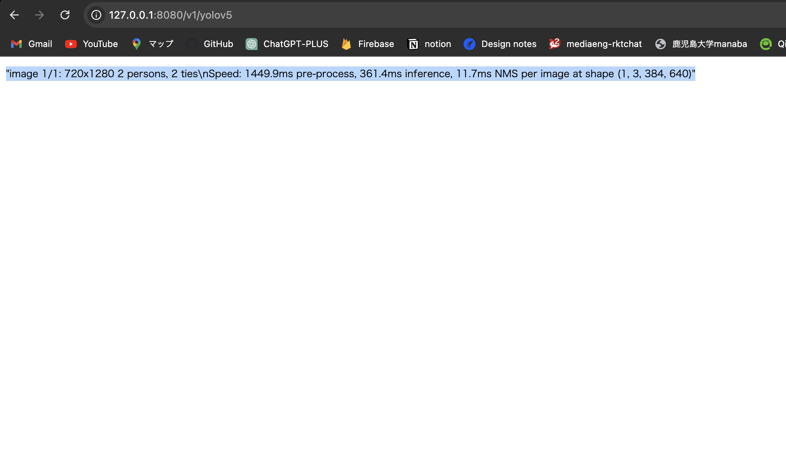
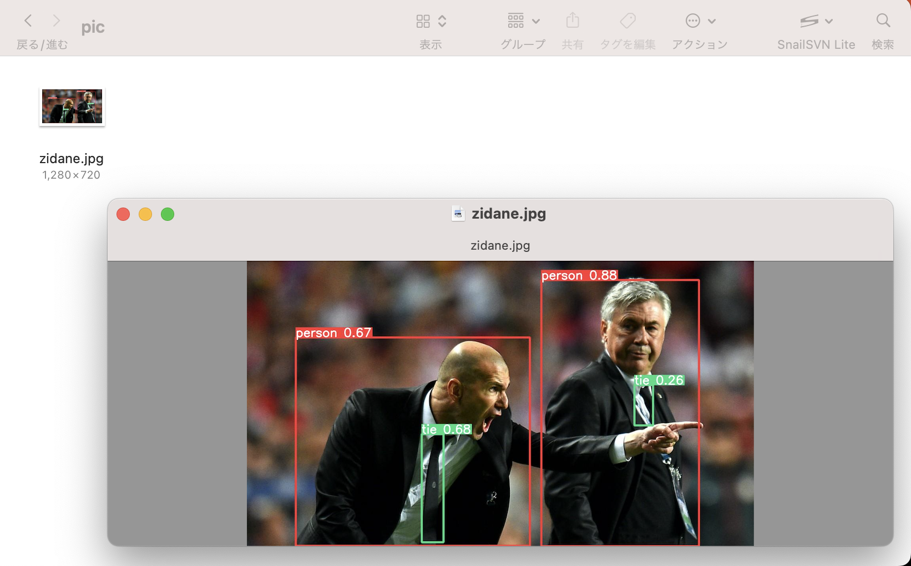

# ml-api

## 環境構築

2種類の環境構築を行います。(`ローカル` / `デプロイ(Render)`)
デブロイしないで良い という人は `ローカルのみ` で大丈夫です

```
anaconda
python : 3.8.2
pip    : 23.1.2
```

### ローカル

#### 1. Githubからリポジトリをクローン

任意のディレクトリに ml-apiフォルダ が生成されることを確認

```terminal.sh
$ cd 任意のディレクトリ
$ git clone https://github.com/hamadayuuki/ml-api.git
$ cd ml-api
```

#### 2. ライブラリのインストール

python, pip のバージョンがあっていれば問題なくインストールできるはずです

```terminal.sh
$ pip install pip==23.1.2                 // 任意
$ conda create -n ml-api python=3.8.2     // 任意

$ pip install -r requirements.txt
```

#### 3. API 実行確認

`APIをたて → URLへアクセス → yolov5による推論 → 出力結果を確認` を行います。

APIのpythonファイルを実行し、コンソール上で[http://127.0.0.1:8080](http://127.0.0.1:8080) の表示を確認

```terminal.sh
$ python ml-api.py

・・・
 * Running on all addresses (0.0.0.0)
 * Running on http://127.0.0.1:8080
 * Running on http://192.168.1.28:8080
・・・
```

<br>

[http://127.0.0.1:8080/v1/yolov5](http://127.0.0.1:8080/v1/yolov5) へアクセスし、以下2点を確認

`①:レスポンスが返ってきているか`

"image 1/1: 720x1280 2 persons, 2 ties\nSpeed: 1449.9ms pre-process, 361.4ms inference, 11.7ms NMS per image at shape (1, 3, 384, 640)"



<br>

`②:対象のフォルダにyolov5の結果(zidane.jpg)が出力されているか`

対象のフォルダ : ml-api > result > yolov5 > pic




### デプロイ(Render)

#### 1. Github/Renderの設定

[Herokuが無料で使えなくなるのでRenderへ移行する（Renderのデプロイ） - Qiita](https://qiita.com/matsutogen/items/f29ad5c244fdca24e4cf) の `1．GitHubのアカウントを作成`〜`GitHudと接続`に取り組む

#### 2. Renderを使ったデプロイの詳細設定

少し特殊で、1 で参考にしたQiitaの記事と異なる部分があります

**Settings**
```
Name : 任意
Region : Singapore
Branch : main
Build Command : $ pip install pip==23.1.2 && pip install -r requirements.txt
Start Command : $ gunicorn ml-api-render:app
Auto-Deploy : Yes
```

**Environment**

Environment Variables
```
Key : PYTHON_VERSION
Value : 3.8.2
```
